# Project1 - WorldHappinessReport
This is first group project, with group members:
1) Tejal Kotkar
2) Savita Hirilall
3) Hibo Dahir
4) Phanit Tameerug

## Hypothesis:
* **The core message of our group is to analyze and visualize the survey done on Happiness Score data for the past three years and to understand how the key factors are related to the Happiness Score of 156 countries.**

* **And to understand if there is any relationship between  Happiness Score and Human Development Index (HDI) of these countries.**

## Data Source:
* **World Happiness survey data is from Kaggle [https://www.kaggle.com]**
* **Human Development Index(HDI) API was taken from [http://hdr.undp.org/en/content/human-development-report-office-statistical-data-api]**

## Compelling questions found for this analysis:
#### 1) How does happiness score depend on different demographic factors i.e. GDP/ Economy, Health & Corruption?

**Analysis:**
* Happiness score is strongly related to GDP based off of r-value.
* Happiness score is strongly related to Health based off of r-value.
* Happiness score increases as GDP & Health increases.
* Happiness score is not related to corruption based off of r-value. Looks like people are not that much concern about corruption.
* Corelation of GDP, Health to happiness score is almost same across last 3 years.

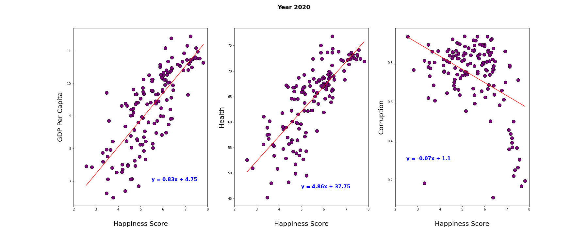
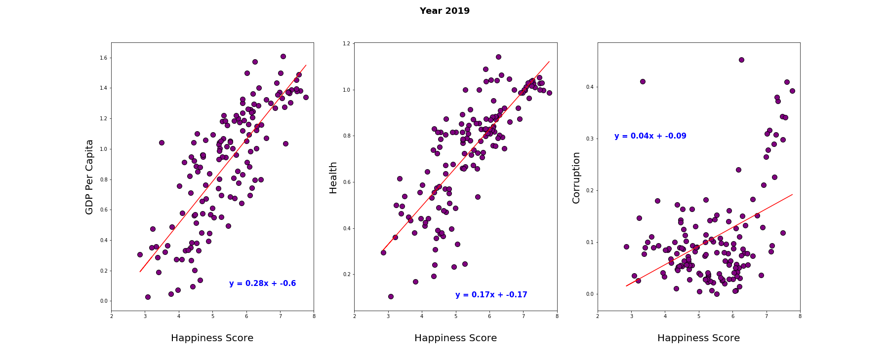
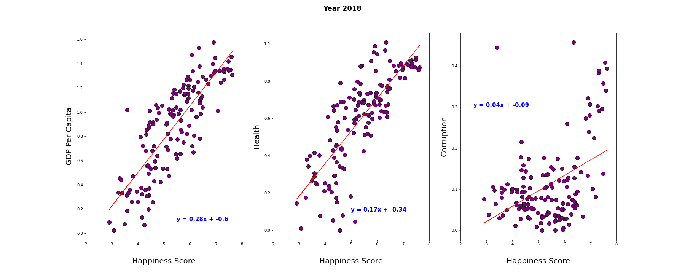

#### 2) What are the similar facts for the top and bottom 5 countries?

**Analysis:**
* All top 5 countries are from Europe region for all 3 years
* Finland maintained its position of the most happiest country all over years
* Most of Bottom 5 countries are from Africa region over all 3 years
* Could not comapre similarities in terms of demographics as health measures are different in year 2020 compare to 2018 & 2019
* For top 5 countries in year 2018 & 2019 there is not much differnce between Health & GDP demographics
* Looking at bottom 5 countries in year 2018 & 2019, looks like country Central African Republic is an exception as its demographics are lower than that of the bottom most country still it has greater happiness score.

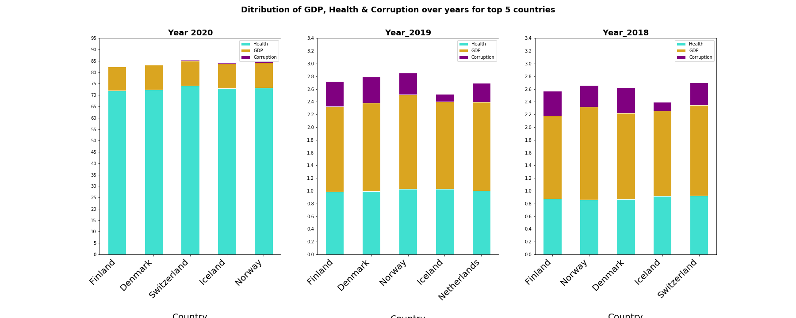

#### 3) Which is the most and the least Happy Region in the dataset? Are there any outliers in terms of happiness score across region over the years?

**Analysis:**

* North America is the consistently most happiest region over the years.
* Africa is consistently least happiest region over the years.
* Region wise there is not much difference in happiness score over last 3 years.
* Africa region has most outliers over the last 3 years
* Commonwealth (Coomonweath of Independent States) & Europe region has been consistent over the last 3 years with no outliers at all.

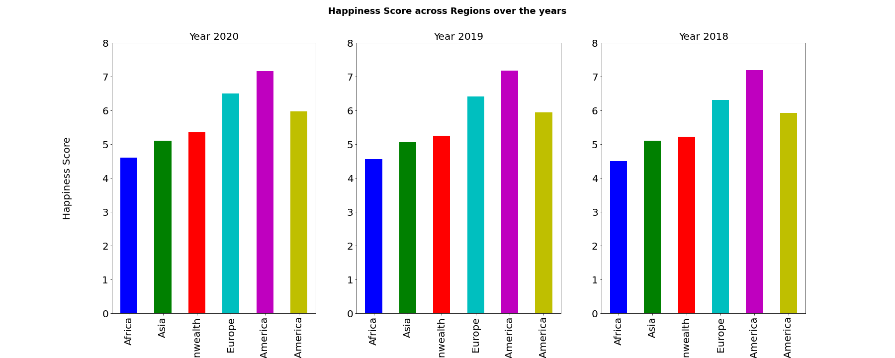
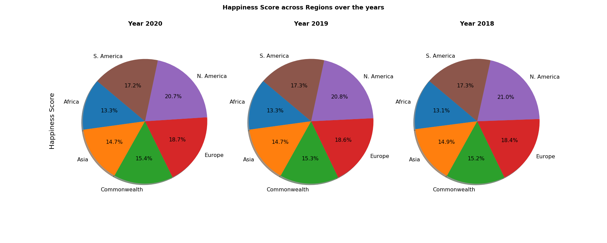
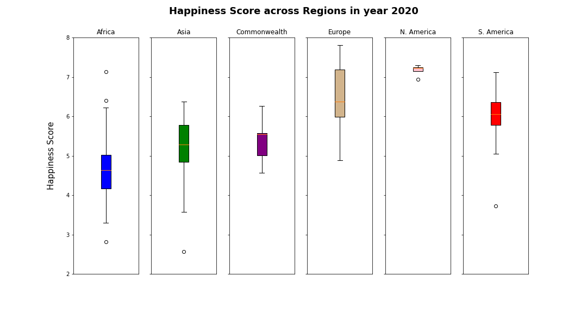
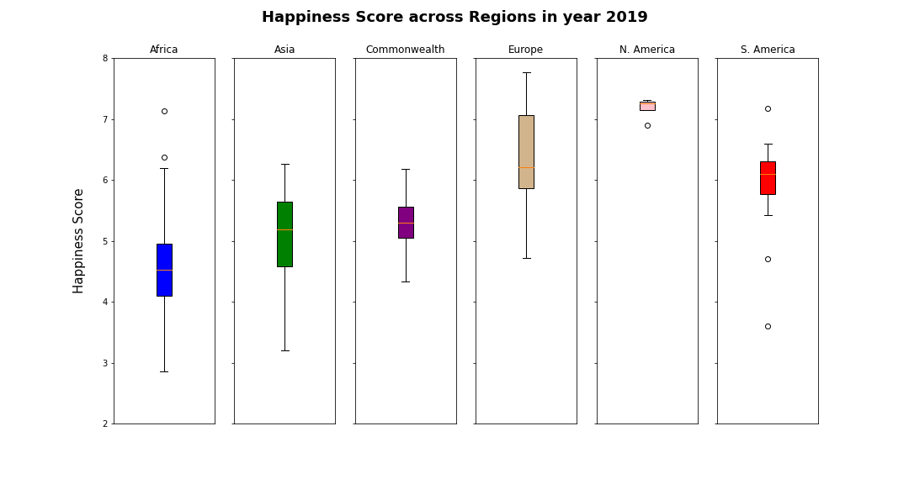
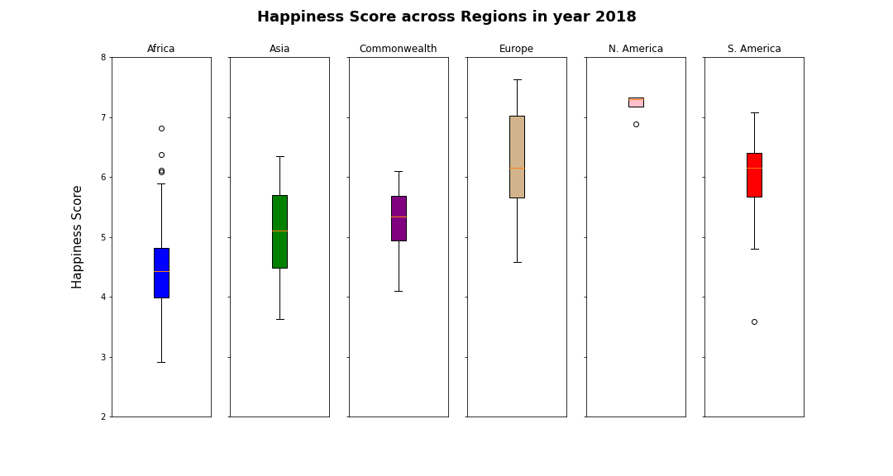

#### 4) Which country experiences a significant increase or decrease in their happiness score?

**Analysis:**
* The country that experienced a significant increase in happiness is Benin, Africa. There is a moderate increase after calcualting the delta score is 1.075.
* Afghanistan has experienced a significant decline over the years furthersome, after calculating the delta score, the country is, scoring -1.0651.

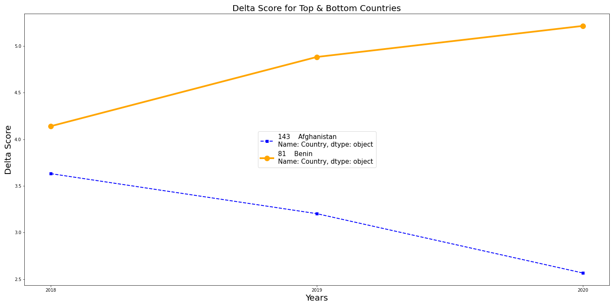

#### 5) What is the trend of happiness score for USA, over three years?

**Analysis:**
* The happiness score in US from year 2018 to 2019 has shown increasing trend.
* Rate of hapiness from 2019 to 2020 is far higher than the rate from 2018 to 2019d.

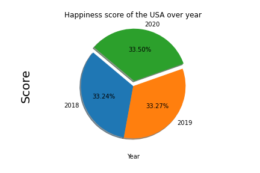
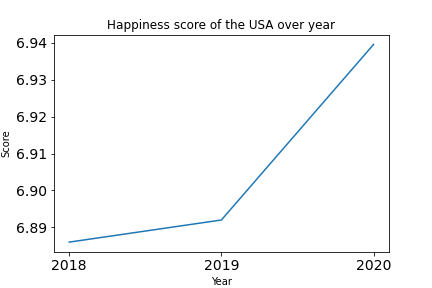

#### 6) Is there any relationship between Happiness score to HDI?

**Analysis:**
* As per the r-value from the below graph, Happiness score and HDI have postive correlation.
**Note:** HDI Score is avalible only for year 2018. Website is not updated for year 2019 and 2020.

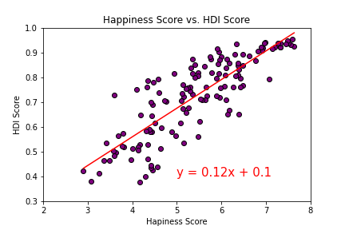
